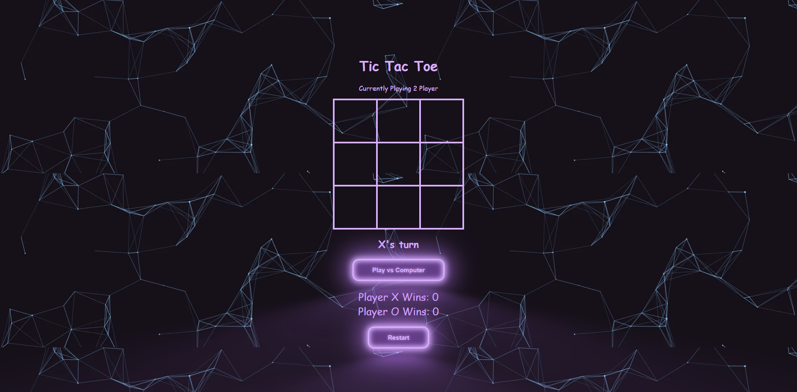

# Tic-Tac-Toe Game 🎮❌⭕️

A stylish web-based Tic-Tac-Toe game built with HTML, CSS, and JavaScript. Play in 2-player mode or challenge a basic AI in computer mode!

## 🧠 Features

- ✅ Two-player mode and vs computer toggle
- 🤖 Simple AI opponent (blocks, wins, and picks smartly)
- 🎨 Glowing UI with animated buttons and a retro vibe
- 🏆 Win tracking for both players
- 🔁 Restart functionality
- 📱 Fully responsive layout

## 📸 Preview

  

## 🚀 Getting Started

To run the game locally:

1. Clone the repository or download the files.
2. Open `index.html` in any modern web browser.

```bash
git clone https://github.com/your-username/tic-tac-toe-game.git
cd tic-tac-toe-game
```

## 🧠 How the AI Works

The computer opponent follows a simple strategy:

- Try to win if possible.  
- Block the human player if they're about to win.  
- Take the center if available.  
- Otherwise, choose a random open cell.

---

## ✨ Technologies Used

- **HTML5**
- **CSS3** (Grid, Variables, Box Shadows)
- **JavaScript** (DOM Manipulation, Game Logic)

---

## 📃 License

This project is open source and free to use.
